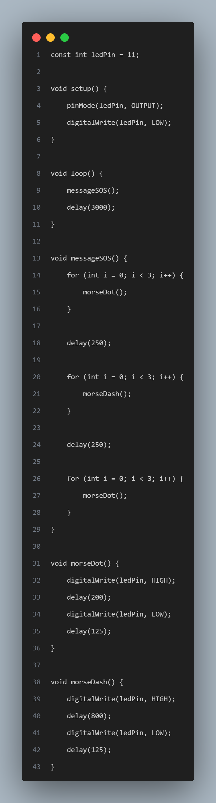
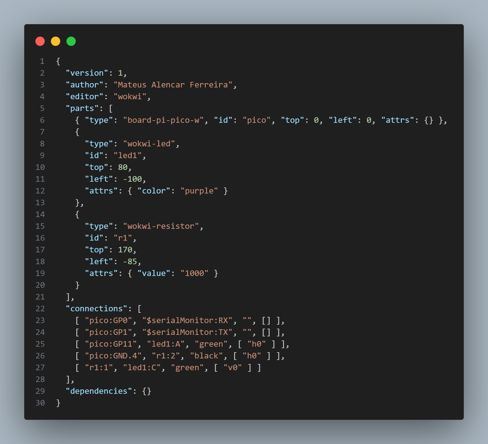
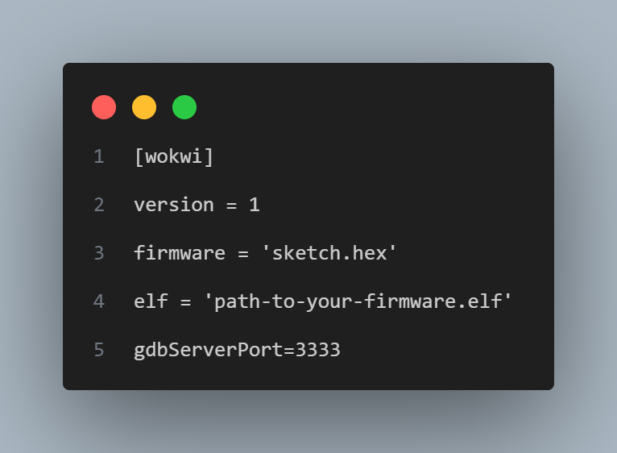
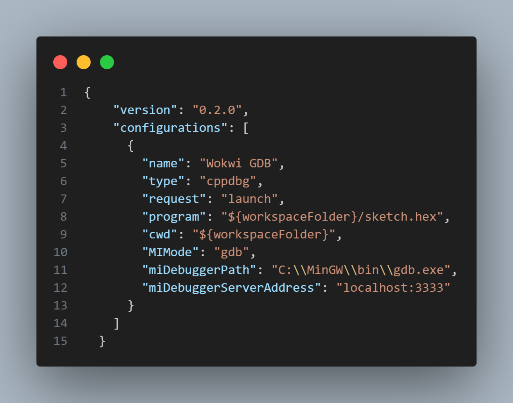
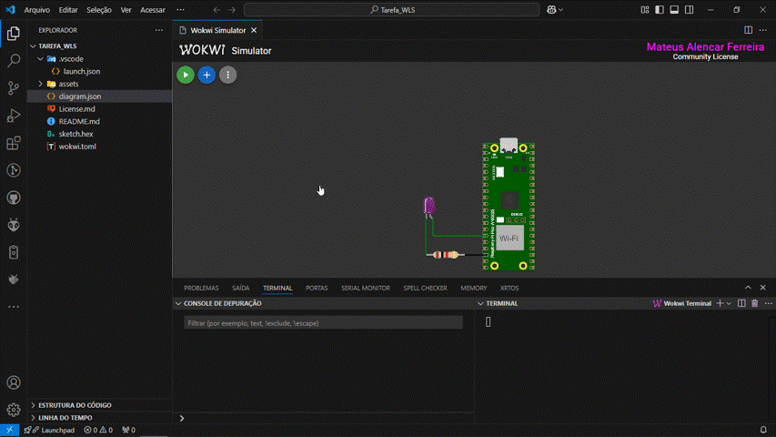

# Projeto SOS - Código Morse com Raspberry Pi Pico W

<h1 align="center"> Projeto SOS - Código Morse</h1>

<h3 align="center">Transmissão do Sinal SOS com LED Externo</h3>

<h4 align="center">🚧 Projeto Finalizado 🚧</h4>

Tabela de conteúdos
=================
<!--ts-->
   * [Sobre o projeto](#-sobre-o-projeto)
   * [Layout Repositório Github](#-layout-repositorio-github)
   * [Funcionalidades](#-Funcionalidades)
   * [Como executar o projeto](#-como-executar-o-projeto)
     * [Pré-requisitos](#-pré-requisitos)
   * [Tecnologias](#-tecnologias)
   * [Contribuidores](#-contribuidores)
   * [Licença](#-licença)
<!--te-->

## 💻 Sobre o projeto

Este projeto consiste em utilizar um LED externo conectado ao Raspberry Pi Pico W para transmitir o sinal SOS em código Morse, seguindo as especificações fornecidas na atividade prática.

## 🎨 Layout Repositório Github

- `src/` - Contém o código fonte em C++.
- `diagram.json` - Configuração do circuito no Wokwi.
- `README.md` - Este arquivo de documentação.
- `Tarefa.pdf` - Documento explicativo do projeto.
- `assets/image/` - Contém imagens de cada um dos códigos.
- `assets/gif/` - Contém um GIF demonstrando o projeto em funcionamento.

### Demonstração Visual

Imagens do projeto:
- 
- 
- 
- 

Demonstração do projeto em funcionamento:
- 

## ⚙️ Funcionalidades

- [x] Transmissão do sinal SOS em código Morse
- [x] Simulação no Wokwi
- [x] Uso de funções para modularização

## 🚀 Como executar o projeto

### Pré-requisitos
- Conta no [Wokwi](https://wokwi.com/)
- Visual Studio Code
- Extensão Wokwi para Visual Studio Code

### Rodando o projeto

1. Abra o arquivo `diagram.json` no Wokwi.
2. Execute o código no simulador.
3. Observe o comportamento do LED, que deve piscar em conformidade com o padrão SOS descrito acima.

Para mais detalhes sobre configuração e depuração no Wokwi com VSCode, consulte:
- [Configuração do Projeto](https://docs.wokwi.com/pt-BR/vscode/project-config#wokwitoml)
- [Depuração no Wokwi](https://docs.wokwi.com/pt-BR/vscode/debugging)

## 🛠 Tecnologias

- **Visual Studio Code**
- **Extensão Wokwi para VSCode**
- **Raspberry Pi Pico W**
- **Wokwi**

## 👨‍💻 Contribuidores

GRUPO 1, SUBGRUPO 3 da Embarcatech  
Mentor: MANOEL MESSIAS DA SILVA JUNIOR

<table>
  <tr>
    <td align="center"> <a href="https://github.com/ferreiramateusalencar">Mateus A. Ferreira<a/> Contribuição: Interface de usuário e Arquitetura de software <a href="https://github.com/ferreiramateusalencar/Conversor-de-Unidades-C" title="Lider do Projeto">👨‍🚀</a></td>
  </tr>
</table>

## 📄 Licença

Este projeto está sob a licença do SUBGRUPO 3 e seu Lider de Projeto da Formação Básica em Software Embarcado da Embarcatech - Veja o arquivo <a href="https://github.com/ferreiramateusalencar/Tarefa_Morse_PI_PICO/blob/main/License.md">License.md<a/>

---

*Projeto desenvolvido durante o Embarcatech.*

